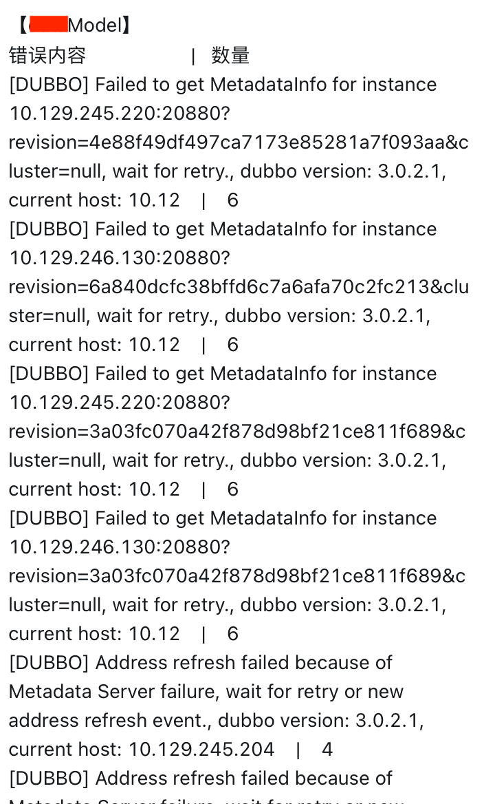
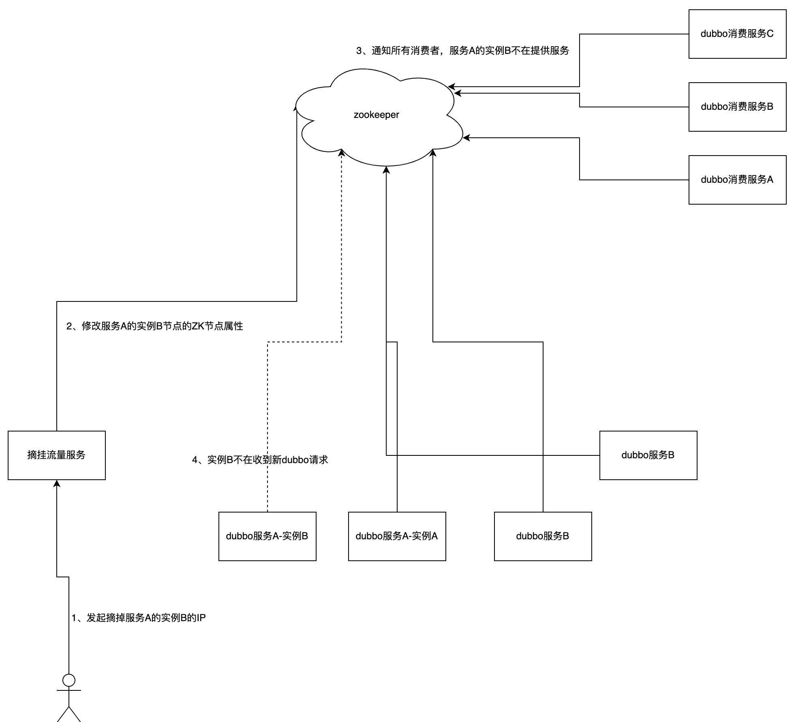

# 1.什么是ark-dubbo-governance？
&emsp;&emsp;ark-dubbo-governance是ark系列框架中的负责dubbo服务治理的服务。
# 2.ark-dubbo-governance解决了什么问题？
&emsp;&emsp;ark-dubbo-governance用于dubbo服务治理场景，目前版本主要用于dubbo服务的无损上下线场景（摘挂流量）。在此之前，我们经常会遇到某个服务正在上线，导致其他服务调用后出现异常的情况。
<div align="left">

</div>
&emsp;&emsp;上图中，服务A调用服务B，服务B正在上线，服务A调用服务B时，会出现异常。为了解决这个问题，我们需要在服务B上线前，先摘流量，然后再上线服务B，上线完成后，再挂流量。这样就可以保证服务B上线时，不影响其他服务的调用。

# 3.ark-dubbo-governance的使用场景
 - 当把nacos作为dubbo的注册中心，摘挂dubbo流量的场景。
# 4.ark-dubbo-governance服务如何启动？
&emsp;&emsp;修改配置文件 config/application-dev.properties 中nacos地址和namespace
>  nacos.serverAddr=192.168.0.1:8848 <br/>
>  nacos.url=http://192.168.0.1:8848 <br/>
>  nacos.namespace=public
# 5.ark-dubbo-governance服务如何使用？
1. 摘流量接口：/dubbo/operate/enable?ip=192.168.1.121 <br/>
使用场景：当线上发布前，需先调用摘流量接口，然后等待30S 后，再使用kill -15 正确关闭应用服务。

2. 挂流量接口：/dubbo/operate/disable?ip=192.168.1.121 <br/>
使用场景：当线上发布完成后，先等待30S ，然后调用挂流量接口。注：如果摘流量后，不执行挂流量，即便dubbo服务启动后，仍然不能对外提供服务。
```java
返回值：code 0 ，代表执行成功。其他情况代表失败，应停止继续发布流程。
{
"code": 0,
"msg": "ok",
"data": null,
"timestamp": 1664246234844
}
```

# 7.设计原理
- 采用无感知设计，业务系统的dubbo服务不需要集成摘dubbo流量组件，也无需感知摘流量服务的存在即可完成应对流量的无损上下线。
<div align="left">

</div>

# 8.后续规划
  | 类型 | 是否支持摘挂流量 |
  | :----: | :----: | 
  | dubbo | 支持 | 
  | http | 支持 |
  | rabbitmq | 支持 |
  | rocketmq | 支持 |
  | xxl-job	 | 支持 |
  | es-job	 | 支持 |

